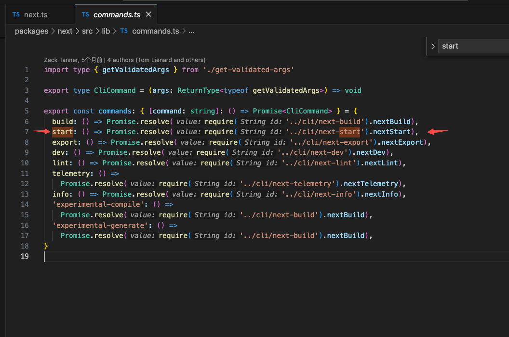
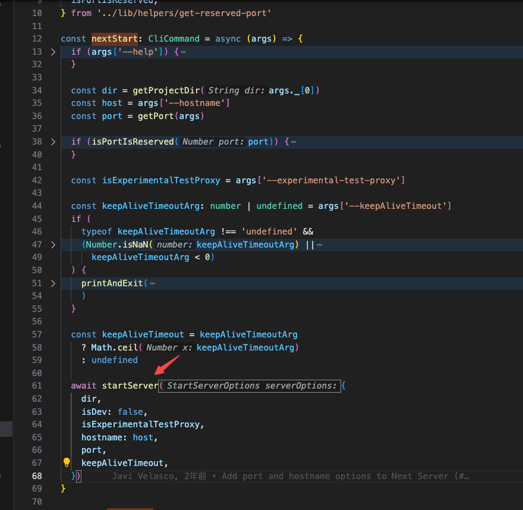
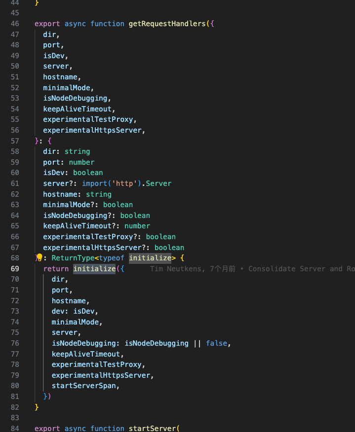
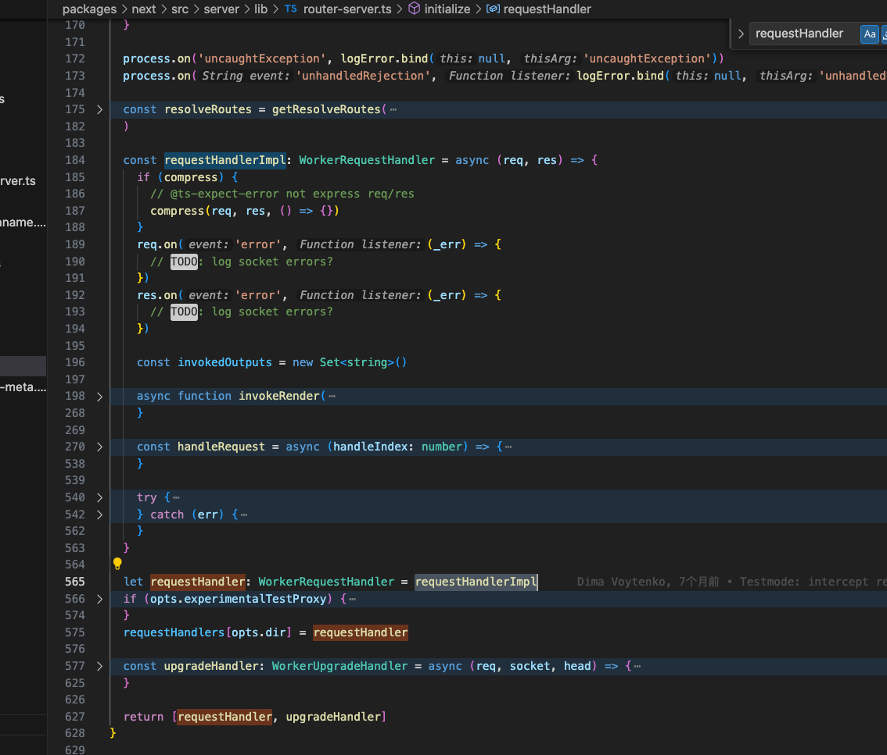
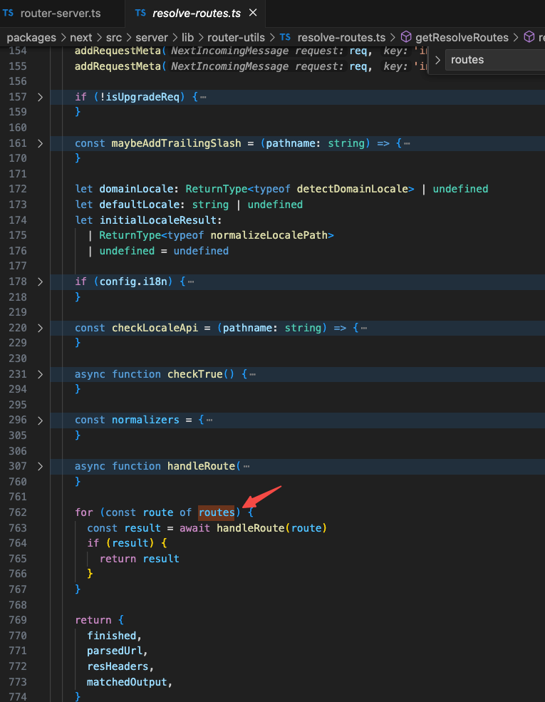
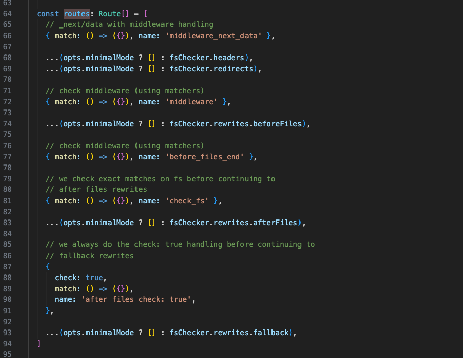
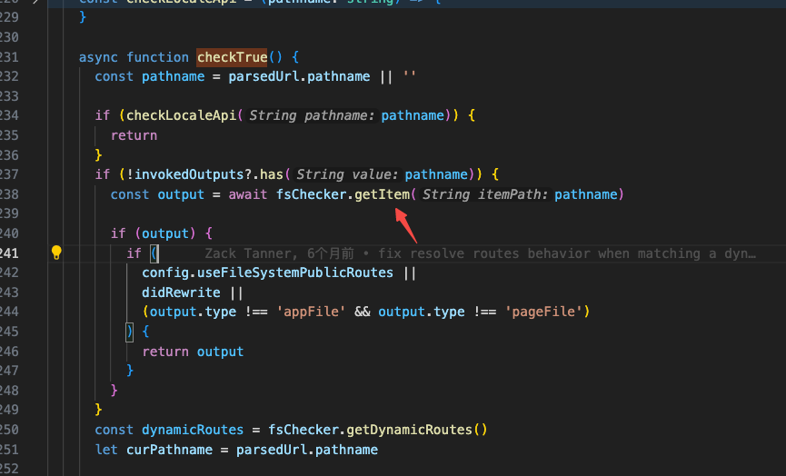

# 解析Next.js的 next start启动服务后，怎么处理请求

start命令入口

startServer启动服务

监听请求回调，requestHandler来自于getRequestHandlers返回的第一项

getRequestHandlers返回initialize的返回值

requestHandlerImpl

调用resolveRoutes处理请求，循环routes处理

routes对应生命周期，依次处理middleware、headers、redirects、rewrites

最后一个查询如果找到本地文件直接返回
