# 解析Next.js的router

### 把appRouter对象注册到Provider
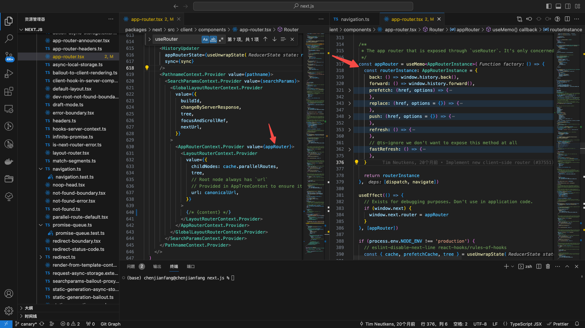

### push方法解析
传递当前href到navigate方法
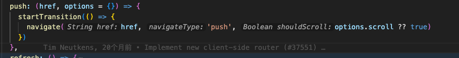

navagate方法来自于useNavigate
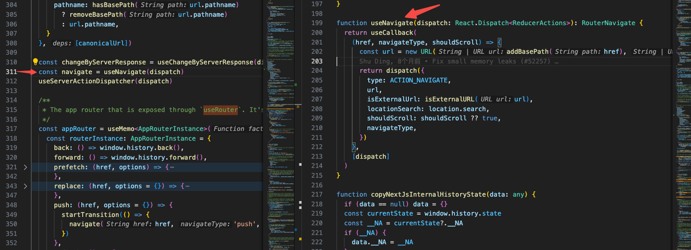

小结：push方法其实触发了dispatch({navigateType: 'push'})事件

#### 解析dispatch
dispatch来自于ActionQueueContext
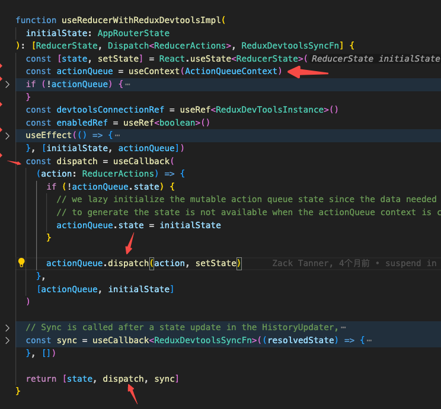

ActionQueueContext的值来源createMutableActionQueue
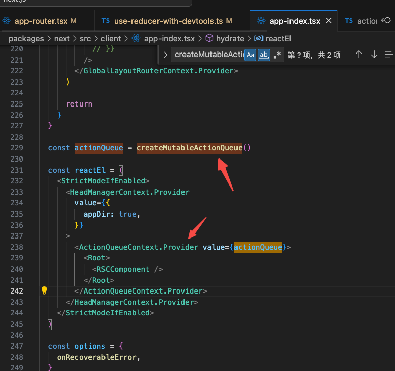

createMutableActionQueue触发action中的reducer

触发clientReducer函数，调用navigateReducer
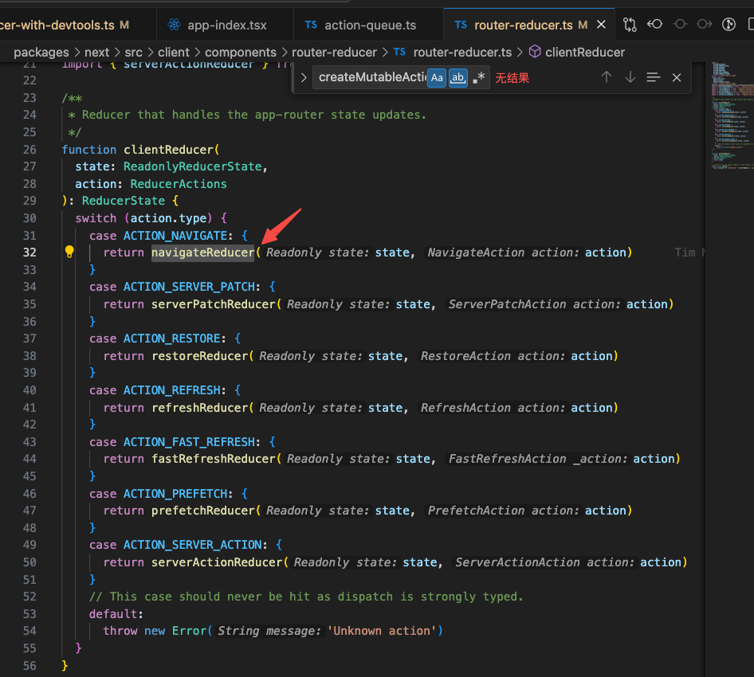

navigateReducer_noPPR内准备好数据后调用handleMutable
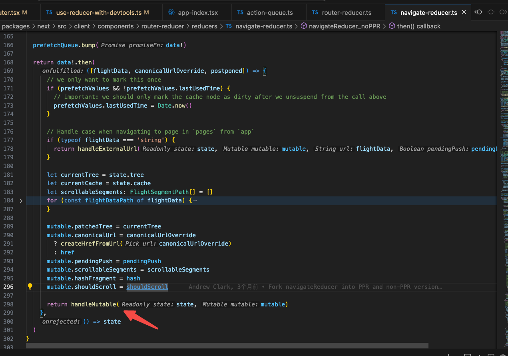

handleMutable获取最终数据后更新reducerState

appRouterState更新触发history更新
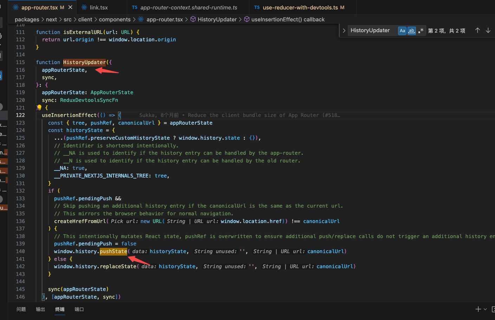
d

### prefetch方法解析
prefetch同push也会调用clientReducer方法，执行prefetchReducer
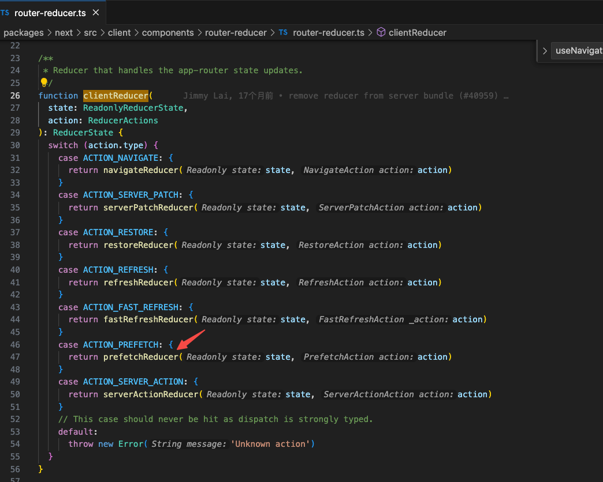

prefetchReducer函数内调用fetchServerResponse
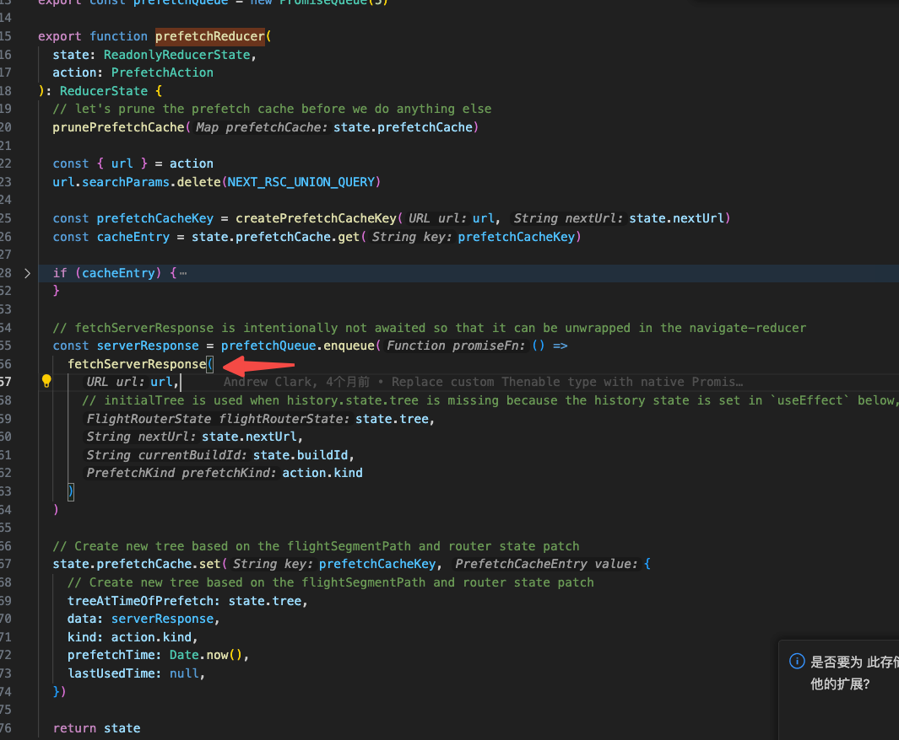

fetchServerResponse调用fetch方法获取静态资源
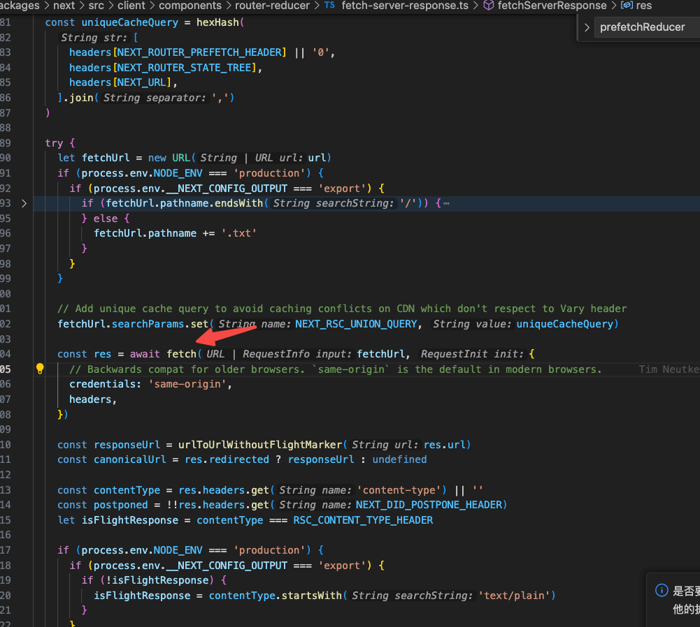

抓包获取静态资源列表
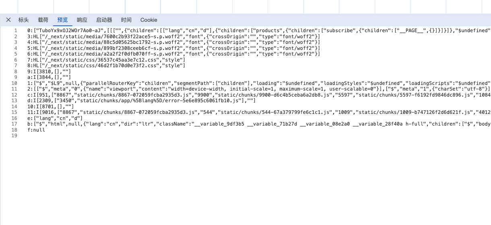

Link组件的prefetch也是同样调用此prefetch方法预下载

