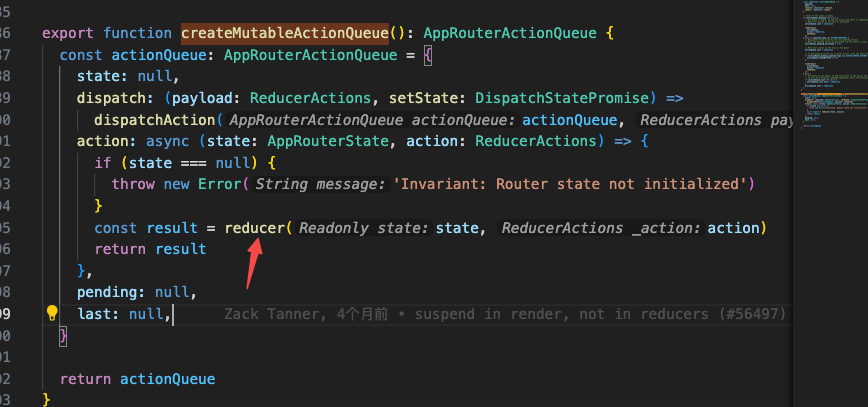

# 解析Next.js的router

### 把appRouter对象注册到Provider

### push方法解析
传递当前href到navigate方法

navagate方法来自于useNavigate

小结：push方法其实触发了dispatch({navigateType: 'push'})事件

#### 解析dispatch
dispatch来自于ActionQueueContext

ActionQueueContext的值来源createMutableActionQueue

createMutableActionQueue触发action中的reducer

触发clientReducer函数，调用navigateReducer

navigateReducer_noPPR内准备好数据后调用handleMutable

handleMutable获取最终数据后更新reducerState

appRouterState更新触发history更新

d

### prefetch方法解析
prefetch同push也会调用clientReducer方法，执行prefetchReducer

prefetchReducer函数内调用fetchServerResponse

fetchServerResponse调用fetch方法获取静态资源

抓包获取静态资源列表

Link组件的prefetch也是同样调用此prefetch方法预下载

